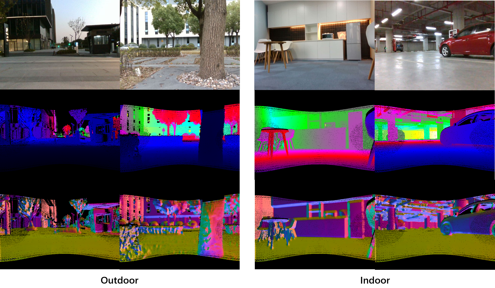
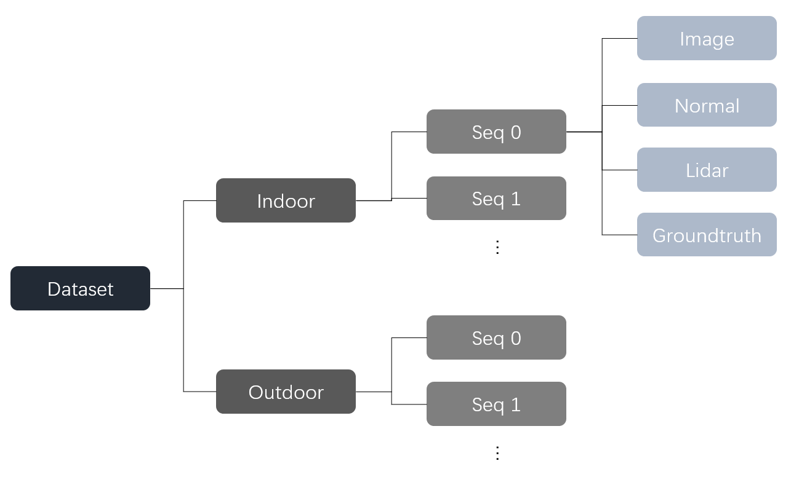
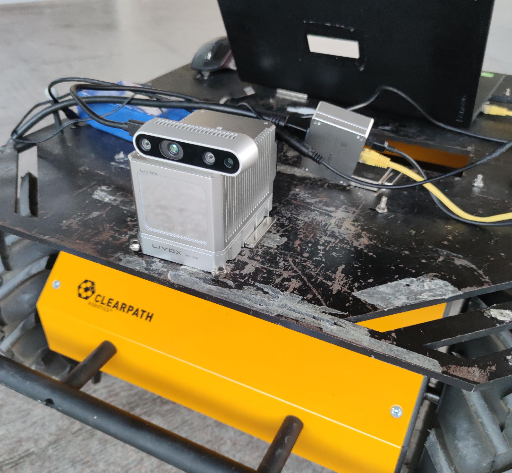
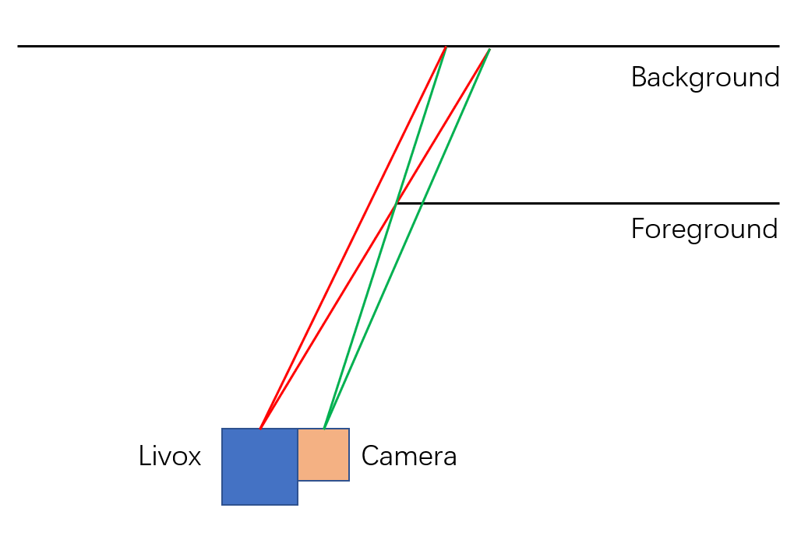

# DenseLivox: A Dense and Accurate Dataset for LiDAR Depth Completion

DenseLivox is a dense and accurate dataset acquired by a low-cost Livox LiDAR. It contains both indoor and outdoor images. DenseLivox is the first dense dataset designed for LiDAR depth completion at low cost.
##

## Dataset Download
Currently, we provide training and validation dataset. The test dataset is coming soon.

*Download links* 
| Dataset |Link|
|  ----  | ----  |
|Train & Validation|https://jbox.sjtu.edu.cn/l/RFkNEG (password: lset)|

## Dataset Structure 
The dataset includes sparse depth maps, dense depth maps, RGB images, and normal maps. The dataset structure is shown below. Every dense depth map corresponds to four sparse depth maps. The format of all data is *.png. 

## Acquisition Set
The set consists of a Livox Horizon LiDAR and a RealSense d435i camera. Horizon
is a solid-state LiDAR with a 260m measurement range. The Horizon's FOV is 81.7° x 25.1° and the d435i's FOV is 64° x 41°. To make a depth completion dataset, we have to choose the part that they intersect. We put the d435i right on the top of the Livox, and they are fixed with glue. The whole set is fixed on the Husky UGV. 

We acquire data in a large area with gardens, buildings, offices, residential, etc. We divide them into sequences. However, Our diversity lies in various scenes and scene combinations, which is our distinction from synthetic datasets.

We use a chessboard to calibrate the intrinsic matrix and radial
and tangential parameters.
We calibrate the extrinsic parameters between sensors via the method in https://github.com/ISEE-Technology/CamVox. 
After calibration, we merge 50 frames of sparse points cloud to obtain dense points cloud in the camera coordinate.
Due to the displacement of Horizon and RealSense, there are ambiguous regions with a mixture of background and foreground.
As the figure below shows, when the points cloud is transformed from the lidar coordinate to the camera coordinate, the background is occluded by the foreground. We post-process the raw data to eliminate these artifacts. If a pixel corresponds to two depth values after transformation, we use the smaller one to accord light propagation. However, if the ground truth is sparse, such a post-process method is useless.
 

The ground truth depth map consists of 50 non-repetitive
scans. From a single ground truth depth map, we pick four
sparse depth scans. These sparse depth maps correspond to
one common ground truth depth map, normal map, and image. The conversion between depth pixel value and real-world measurements is:
$$  d_{pixel} = d_{real} * 256 $$